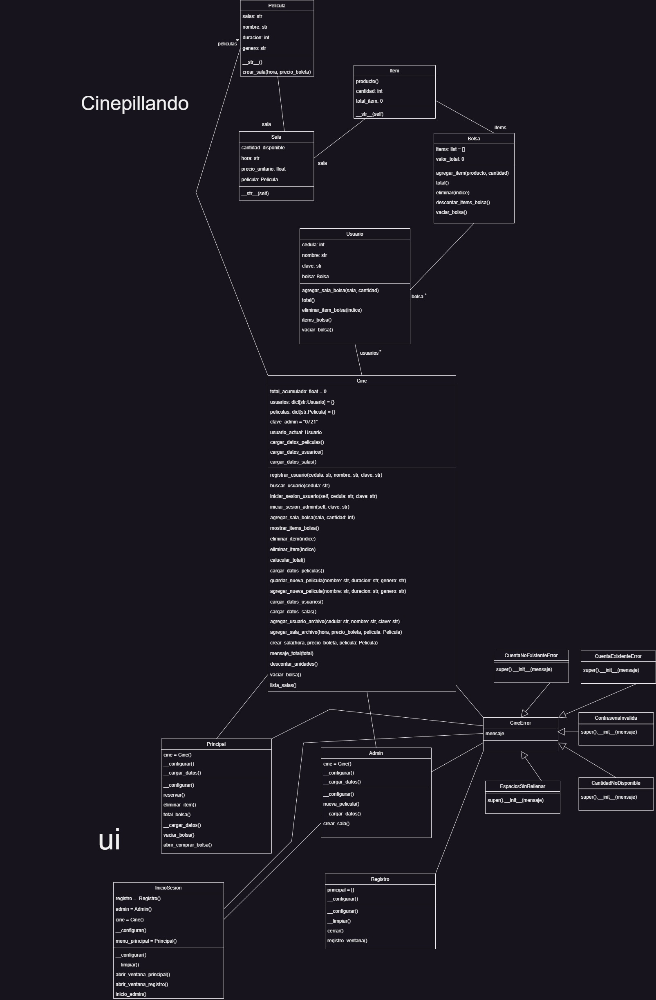

*Trabajo hecho por: Santiago Vieira

Santiago Cordoba

John Sebastian Villegas*

*DESCRIPCIÓN GENERAL DEL PROBLEMA*

La empresa de cine Pillando necesita una aplicación de software para el manejo de reservas y compra de boletas. Actualmente, la empresa maneja una gran cantidad de salas y horarios de proyección, lo que dificulta el control manual de la disponibilidad de los asientos y puede generar errores en la asignación de estos.

La empresa necesita una solución que le permita llevar un registro automatizado y en tiempo real de las reservas, para tener un mayor control y optimizar el uso de sus recursos.

Para lograr esto, se debe implementar un sistema de Programación Orientada a Objetos (POO) que permita la creación de objetos que representen las diferentes salas y horarios de proyección de la empresa, y que, a su vez, se puedan almacenar y manipular de manera eficiente en una base de datos.

Además, la aplicación debe contar con una interfaz gráfica intuitiva que permita al usuario realizar reservas. También es importante que la aplicación tenga funcionalidades adicionales, como la posibilidad de cancelar reservas.

La seguridad es otro aspecto importante para considerar en el desarrollo de esta aplicación, por lo que se debe implementar un sistema de autenticación y control de acceso para garantizar que solo las personas autorizadas puedan acceder y manipular la información.

En resumen, la aplicación de software para el manejo de reservas en el un cine debe cumplir con los siguientes requisitos:

-Ser desarrollada con Programación Orientada a Objetos (POO)

-Consultar una base de datos para verificar las películas disponibles

-Contar con una interfaz gráfica intuitiva para un registro fácil y poder hacer reservas 

-Permitir la manipulación de la información de reservas, incluyendo la posibilidad de cancelarlas

-Implementar un sistema de autenticación y control de acceso para garantizar la seguridad de la información.

*DIAGRAMA DE CLASES*

